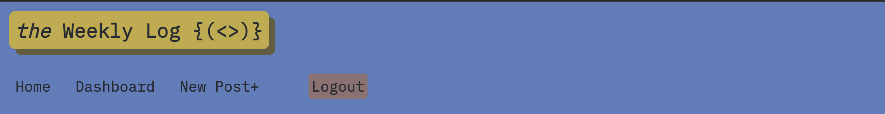
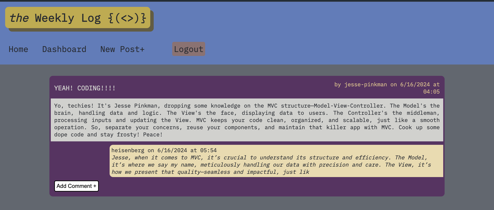
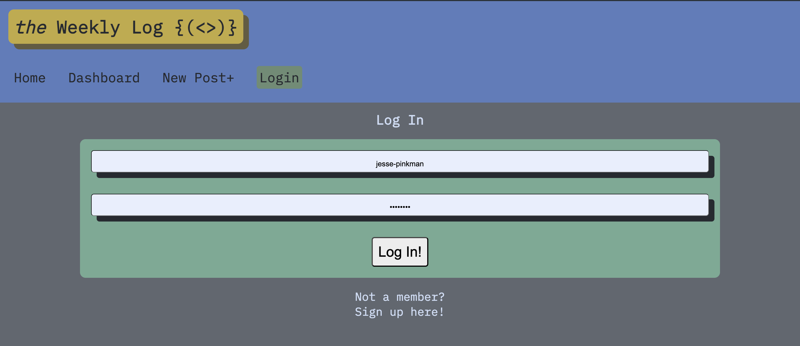
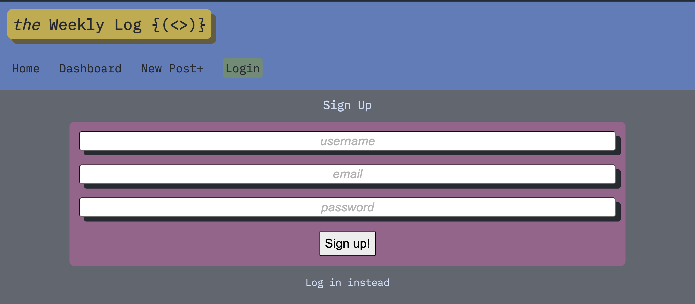
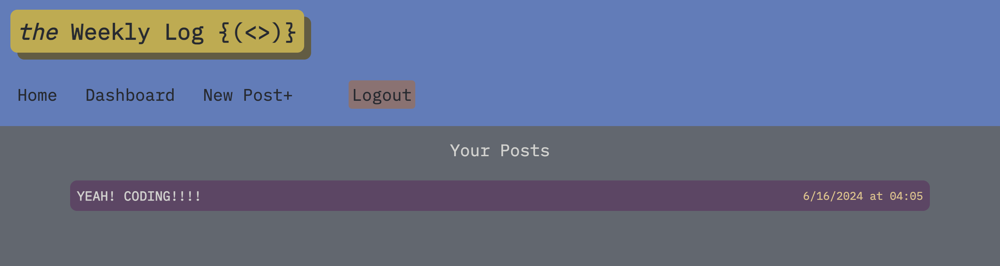
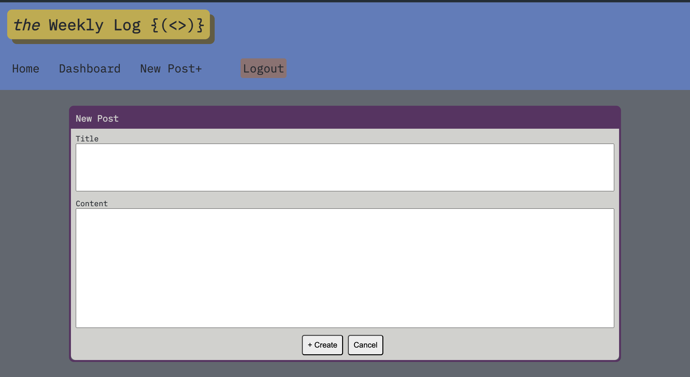
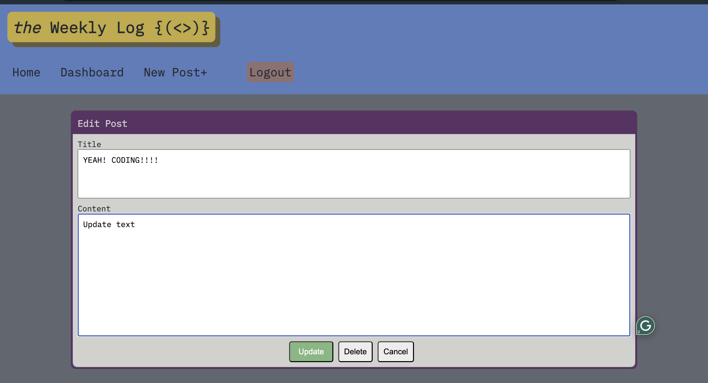
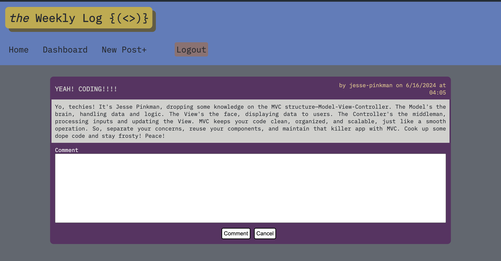
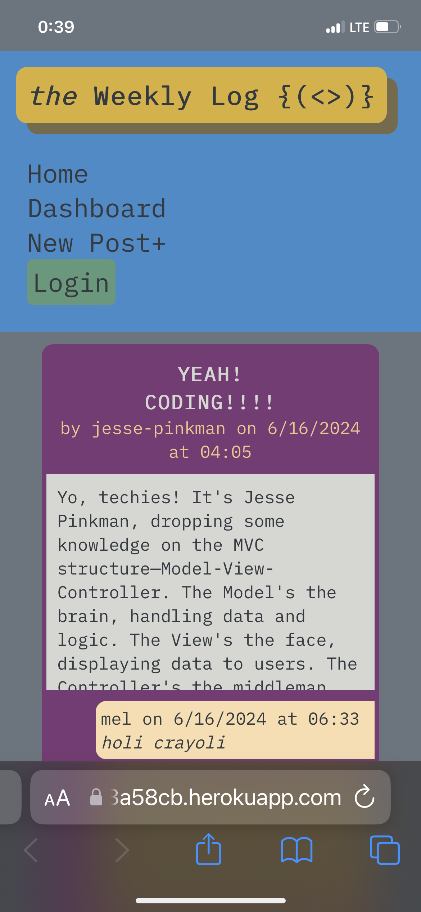

# _the_ Weekly Log `{(<>)}`

## Description

[Click here to open the live webpage](https://the-weekly-log-7ca1ef8a58cb.herokuapp.com) 🌐

_The Weekly Log_ is a dynamic CMS-style blog site designed to foster knowledge sharing and collaboration among developers worldwide. Whether you're a novice looking to learn or a seasoned professional sharing insights, this platform serves as your go-to destination.

### Key Features:

- **User Authentication**: Securely log in or sign up to start sharing your experiences.
- **Create and Manage Posts**: Easily create, edit, and delete posts to showcase your expertise.
- **Interactive Comments**: Engage in discussions with peers through interactive commenting on posts.
- **Responsive Design**: Enjoy a seamless experience across devices with our responsive design.

Explore _The Weekly Log_ today and join the global community of developers sharing their journeys!

## Table of Contents

* [Installation](#installation)
* [Usage](#usage)
* [Features](#features)
* [Credits](#credits)
* [License](#license)

## Installation

N/A. (Since the project is a deployed website, there's no need for installation steps.)

## Usage

1. **Accessing the Website**:
   - Open your web browser search this URL: https://the-weekly-log-7ca1ef8a58cb.herokuapp.com where you will land on 'Home' 

   

   - There, you can either log in with your existing credentials or sign up for a new account.

   

   

2. **Navigating the Dashboard**:
   - Once logged in, you will be able to manage your posts and interact with the community.

   

   - Use the sidebar menu to navigate between different sections such as creating new posts, viewing and editing existing posts, and exploring comments.

   

3. **Creating, Editing, and Deleting Posts**:
   - Posts can be edited or deleted from your dashboard. Click on the post title to open it for editing or delete it using the provided options.

   

4. **Interacting with Posts and Comments**:
   - On the homepage, browse through posts shared by other users.
   - Add your insights or feedback by commenting directly on the post. Engage in discussions with peers to share knowledge and opinions.

   

5. **Responsive Design**:
   - _The Weekly Log_ is designed to provide a seamless experience across devices. Whether you're using a desktop, tablet, or mobile device, the website adapts to ensure usability and accessibility.

   

### Features

- **User Authentication**: Secure login and signup process to access all features.
- **Post Management**: Create, edit, and delete posts with ease.
- **Commenting System**: Engage in interactive discussions through comments on posts.
- **Responsive Design**: Enjoy a consistent experience across devices.

## Credits

This project was created by [Marcos Munoz](https://github.com/marcusmr15) with the aid of:

* The `ChatGPT` AI developed by __Open AI__.
* The `Xpert Learning Assistant` AI developed by __edX__.
* The [Thomas-Model-View-Controller-MVC-Tech-Blog](https://github.com/ThomasCalle/Thomas-Model-View-Controller-MVC-Tech-Blog) repository by [Thomas Calle](https://github.com/ThomasCalle).

## License

MIT License.
